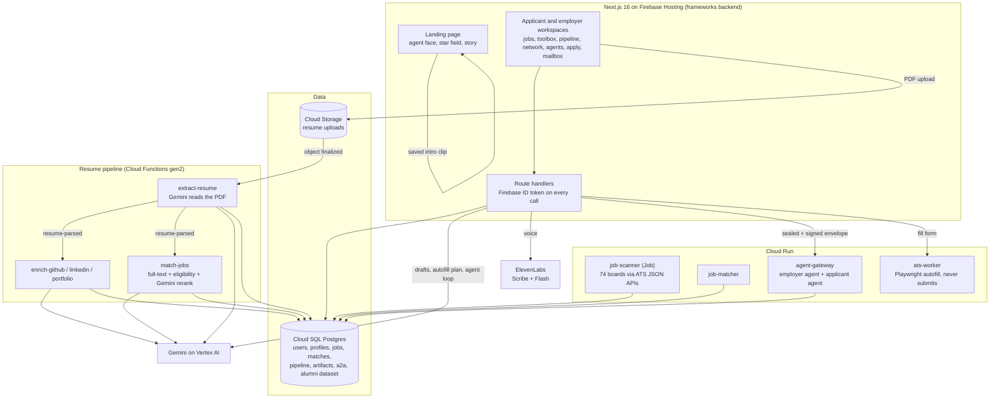

<div align="center">

# ◐ agentHire

**A voice-first job application agent. Neither side moves until both prove who they are.**

*Built at hackUMBC 2026 (Sep 26–27) by a team of four. The applicant's agent finds the roles, drafts the materials and applies. It does that only after the employer's agent proves it is real, and every message between the two agents is signed and encrypted.*

[](https://project-96b6d773-106a-457a-a46.web.app)
[](https://nextjs.org/)
[](https://react.dev/)
[](https://www.typescriptlang.org/)
[](#-api-reference)
[](#%EF%B8%8F-voice)
[](#%EF%B8%8F-deployment)
[](#-the-agent-to-agent-trust-protocol)

</div>

> **Living document.** This README grows with the project. The [changelog](#-changelog) at the bottom records what changed and when, and every feature row carries a status: ✅ working · 🟡 partial or sample data · 🚧 placeholder UI.

---

## 📖 Why this exists

Job hunting is broken on both sides of the table:

| Problem | What it looks like |
|---|---|
| **Applications disappear** | Hundreds of applications, most never answered, and no word on which ones were even read. |
| **The same form, every time** | Name, school, dates, the same PDF uploaded again, retyped on every company's applicant tracking system. |
| **Some doors are fake** | Postings that exist only to collect resumes, from companies that were never hiring. |
| **Employers drown too** | Fabricated and mass-generated applicants make it hard to find the real ones. |

agentHire gives the student an **agent** that does the work, and it adds a **handshake**. Before any private data leaves the student's side, the employer's agent must present a verifiable identity and pass a trust check. The same check runs in reverse on applicants. If either side cannot prove who it is, the agent **refuses out loud** and releases nothing.

Two rules shaped every decision:

| Rule | What it meant in practice |
|---|---|
| **Every number is grounded** | The model never invents a figure. Career answers come from tool results over the dataset and cite their cohort size (*n*). Drafted documents pass a fact gate before they can be printed. |
| **Nothing leaves without proof and consent** | Applications travel as signed **and** encrypted envelopes. The autofill worker fills a real form but never submits it. The agent never applies without an explicit yes. |

---

## 🏆 Tracks we're entering

| Track | What we built for it |
|---|---|
| **Overall** | A full product: resume intake → enrichment → job matching → drafting → verified agent-to-agent apply, with voice on top |
| **DoIT: Navigating the Future: Career Pathways & Degree ROI** | The hackUMBC alumni and campus dataset loaded into Postgres, an alumni network built on it, and a career agent with `career_pathways`, `degree_roi` and `skill_gap` tools *(tools still return sample numbers; see [known gaps](#-known-gaps--whats-next))* |
| **CyberDawgs Cybersecurity Application** | The A2A gateway: ES256-signed envelopes, ECDH + AES-256-GCM sealing, replay protection, a trust index and an offline attack battery. *Requires the extensive documentation in the [trust protocol](#-the-agent-to-agent-trust-protocol) section and `functions/README.md`* |
| **Best Entrepreneurial Idea** | A two-sided product for students and employers, where verified identity is the moat |
| **Most Engaging Demo** | Tap the agent's face and it introduces itself out loud, then watch it refuse an employer that cannot prove who it is |
| **MLH: Best Use of Gemini API** | Gemini runs the resume extraction, the enrichers, match reranking, document drafting, autofill planning and the agent's tool loop |
| **MLH: Best Use of ElevenLabs** | agentHire's voice: a saved intro clip on the landing page, and a spoken **gap interview** on the Jobs page that asks about missing skills and hears the answers (Scribe speech-to-text + Flash text-to-speech) |

---

## ✨ What's in it

| Feature | Description | Status |
|---|---|---|
| 🗣️ **Talking agent face** | A three.js face with six moods (idle, listening, thinking, speaking, happy, refusing). Tap it on the landing page and it introduces itself in its ElevenLabs voice. The clip is a saved file, so it costs nothing to play. | ✅ |
| 📄 **Resume intake** | A PDF goes straight to Cloud Storage. A Cloud Function reads it with Gemini into a versioned profile, and the progress page streams each step live. | ✅ |
| 🔎 **Profile enrichment** | GitHub (REST API), LinkedIn (Gemini with Google Search grounding) and the applicant's portfolio site, fanned out over Pub/Sub. | ✅ |
| 🧭 **Job scanning** | A Cloud Run Job sweeps 74 employer job boards through their public ATS JSON APIs (Greenhouse, Ashby, Lever), with no scraping and no LLM. | ✅ |
| 🎯 **Job matching** | Postgres full-text retrieval, then an eligibility gate (sponsorship, citizenship, clearance), then a Gemini rerank giving a 0–100 fit, a reason, and the skills you have and lack. | ✅ |
| 🧰 **Job toolbox** | Five instant rule-based reads of a posting, plus Gemini drafts (cover letter, answers, resume) behind a **fact gate**: a document that claims something your profile cannot back up cannot be printed. | ✅ |
| 🏢 **Employer check** | Is this company real? Checks where the posting came from, plus a live HTTPS handshake to the company's domain. | ✅ |
| ✍️ **Autofill (never submits)** | Gemini plans the answers, and a Playwright worker on Cloud Run fills the real Greenhouse, Lever or Ashby form and returns a screenshot. Submission is disabled at deploy time. | ✅ |
| 📋 **Pipeline board** | Seven stages (saved → applied → interviewing → offer → accepted, rejected, withdrawn), stored as events rather than overwritten status. | ✅ |
| 🔐 **Verified agent-to-agent apply** | The applicant agent seals and signs an application to the employer agent. The employer reads its mailbox with a single-use signed credential. | ✅ |
| 🕵️ **Agents tab** | The A2A registry and a live audit trail of every envelope: who sent it, whether it verified, and why it was refused if it was. | ✅ |
| 🎓 **Alumni network** | Alumni matched to the student from the hackUMBC dataset, shown as mission cards, with agent-to-agent introductions. The Agents tab shows each exchange, with the cryptographic evidence one tap deeper. | ✅ |
| 🎮 **Game layer** | Daily energy, streaks, XP, levels and achievements for reaching out, all derived from existing rows with nothing extra stored. | ✅ |
| 🧠 **Career agent (Gemini tool loop)** | `/api/agent`: up to 4 tool rounds, answers only from tool results, always states *n*, replies kept under 50 words so they can be spoken. | 🟡 tools return sample numbers |
| 🎤 **Gap interview** | On the Jobs page, the agent counts the skills your matched roles keep asking for that your resume doesn't show, and asks about the top two or three **out loud** (or in a typed form). Gemini turns each answer into a verdict with your own evidence, then only the roles those answers touch are re-scored, each rising by a capped amount. Answers never become resume lines, so the fact gate can't be fooled by a spoken "yes". | ✅ |
| 🎙️ **Voice routes** | ElevenLabs Scribe v2 (speech-to-text) and Flash v2.5 (text-to-speech) behind sign-in and a per-user rate limit. Used by the gap interview; the open-ended hands-free loop (`useVoiceAgent`) is not mounted yet. | ✅ |
| 💬 **Chat drawer** | The right-hand transcript panel on every workspace page. | 🚧 seeded conversation, canned reply |
| 🧑‍💼 **Employer workspace** | The applicant mailbox is real. The overview, candidate search and activity feed are sample layouts. | 🟡 |
| 🌌 **Landing page** | A WebGL star field, a 13-beat scroll story (including two "Built for students" beats on the alumni network and the game layer), a cost ledger, a fraud gate and a handshake explainer. Respects `prefers-reduced-motion` throughout. | ✅ |

---

## 🛠️ Tech Stack

<table>
<tr><td valign="top" width="50%">

**Frontend**
- **Next.js 16 App Router** + **React 19** + **TypeScript**
- Plain CSS with a design-token layer (`globals.css`, `workspace.css`), no UI kit
- **three.js** via `@react-three/fiber` for the agent face and the star field
- **Motion** and **anime.js** for UI motion, **Lenis** for smooth scroll
- `lucide-react` icons, `next/font` (Forum) for zero-layout-shift type

</td><td valign="top" width="50%">

**AI & Voice**
- **Gemini on Vertex AI**: `@google/genai` with the service account for the pipeline and drafting, and REST with a Vertex Express key for the agent loop (`gemini-3.8-flash`, low thinking)
- Function calling with a bounded tool loop and grounded replies
- Google Search grounding for LinkedIn enrichment
- **ElevenLabs**: Scribe v2 (STT), Flash v2.5 (TTS), Multilingual v2 for the saved intro, voice "Charlie"

</td></tr>
<tr><td valign="top">

**Backend & Data**
- Next.js **Route Handlers**, all behind Firebase ID-token verification (`jose` against Google's JWKS)
- **Cloud SQL for PostgreSQL** via the Cloud SQL connector and `pg`; 12 SQL migrations
- Event-sourced pipeline (`application_events` → `latest_application_state` view)
- **Cloud Functions gen2** triggered by Eventarc (GCS upload) and **Pub/Sub** (`resume-parsed` → `profile-enriched` / `jobs-matched`)
- **Playwright** Chromium on Cloud Run for form autofill

</td><td valign="top">

**Security (A2A)**
- **ES256 (P-256) compact JWS** envelopes with `iss/aud/jti/iat/exp` and a 120 s maximum age
- **ECDH P-256 → HKDF-SHA256 → AES-256-GCM** sealing, with the envelope bound in the AAD
- Replay protection via a primary key on seen envelope IDs
- Domain-anchored agent names (`agent://v1.<role>.<domain>`), revocation, and a 5-dimension trust index
- Only `node:crypto`, with no crypto dependencies

</td></tr>
<tr><td valign="top">

**Cloud & Delivery**
- **Firebase Hosting** (web frameworks backend) in `us-east1` and **Firebase Auth** (email + Google)
- **Cloud Run**: agent gateway ×2, job matcher, ATS worker; a Cloud Run **Job** for the scanner
- **Secret Manager** for every credential; **Cloud Storage** with owner-only rules
- **GitHub Actions** with Workload Identity Federation (no stored keys); a preview channel per PR, live deploy on `main`

</td><td valign="top">

**Accessibility & UX**
- `prefers-reduced-motion` respected everywhere; the star field and face hold still
- `aria-live` captions for everything the agent says, including while the chat drawer is collapsed
- Keyboard-reachable face button, labelled controls, focus-visible outlines
- A two-colour system (paper and ink) with one typeface, Forum, across every page and field

</td></tr>
</table>

---

## 🏗️ Architecture



**A verified application, end to end:**

```
student presses Apply on a matched role
   → POST /api/a2a/apply                      (Firebase token, applicant role)
   → body sealed: ephemeral ECDH P-256 → HKDF-SHA256 → AES-256-GCM
   → sealed body signed: ES256 compact JWS  {iss, aud, jti, iat, exp ≤ 120 s}
   → agent-gateway /a2a/apply
        1. parse JWS, allow only ES256        6. check the name is anchored to its domain
        2. look up the sender's registered key 7. check the trust index (5 dims ≥ 65, mean ≥ 75)
        3. verify the signature                8. reject a replayed jti (primary key)
        4. check audience + expiry             9. decrypt, refusing plaintext
        5. refuse revoked registrations       10. store the message, audit the ciphertext hash
   → employer opens Applicants
   → GET /api/a2a/mailbox  → single-use signed read credential → gateway /messages
```

Every refusal is written to `a2a_audit` with its reason and shows up in the **Agents** tab. **A refused application releases nothing.**

---

## 🔐 The agent-to-agent trust protocol

| Piece | File | What it guarantees |
|---|---|---|
| **Identity** | `functions/agent-gateway/lib/identity.mjs` | Names look like `agent://v1.employer.agenthire.biz`. The endpoint must be HTTPS on a host under the claimed domain (dot-anchored, so lookalike domains fail), the role must match the name, and revoked registrations are refused. |
| **Envelope** | `lib/envelope.mjs` | ES256 compact JWS, `typ: agenthire-a2a+jws`, maximum age 120 s, key fingerprint = SHA-256 of the SPKI DER. |
| **Sealing** | `lib/sealing.mjs` | Ephemeral-static ECDH P-256 → HKDF-SHA256 (32-byte salt) → AES-256-GCM (12-byte nonce, 16-byte tag), with AAD `["a2a-seal-1", iss, aud, jti]`. The body is sealed before signing, so the signature covers the ciphertext. |
| **Trust index** | `lib/trust.mjs` | Five dimensions (integrity, identity, solvency, behavior, safety), each with a score **and a written reason**. Each must be at least 65, and the mean at least 75. |
| **Agent card** | `agent-card.json` | Publishes the scheme, encryption spec, required fields, trust policy and 30-day retention. |
| **Attack battery** | `test/attack-battery.mjs` | Offline checks that each of these is refused: impersonation, tampering, `alg:none`, wrong audience, expiry, lookalike domains, revoked keys, truncated or tampered GCM data, off-curve keys, plaintext downgrade, replay, and bad mailbox credentials. |

Run the battery: `node functions/agent-gateway/test/attack-battery.mjs`. The full protocol notes are in [`functions/README.md`](functions/README.md).

---

## 🎙️ Voice

| Piece | Where | Notes |
|---|---|---|
| **Landing intro** | `public/agenthire-intro.mp3` + `AgentGreeter.tsx` | *"Hi, I'm agentHire, your voice-first job agent. I match you to roles and verify every employer first."* Generated once with ElevenLabs, then served as a static file, so **playing it costs nothing**. If the line changes, the clip must be regenerated. |
| **Speech → text** | `POST /api/voice/stt` | ElevenLabs `scribe_v2`, with a 2 MB cap. |
| **Text → speech** | `POST /api/voice/tts` | ElevenLabs `eleven_flash_v2_5` in agentHire's voice, with an 800-char cap. The 40 most recent short lines are cached in memory. |
| **Scripted voice** | `src/components/useVoiceIO.ts` | Speak one line, hear one answer, with the Firebase token attached. The gap interview uses it; stopping part-way drops into the typed form with what was already heard filled in. |
| **Hands-free loop** | `src/components/useVoiceAgent.ts` | Listen → detect end of speech from loudness → STT → `/api/agent` → TTS → listen again. Saying "bye" ends the conversation. Not mounted anywhere yet. |

Both voice routes require sign-in and are limited to 60 calls per 10 minutes per user, so a runaway loop cannot drain credits.

---

## 🎨 Design System

One typeface everywhere. The landing page and the core workspace use two colours, paper and ink, with every other shade as ink at a lower opacity. The Network and Agents screens add an accent palette (violet, teal, coral, green) to tell activities and states apart.

| Token | Purpose |
|---|---|
| `--paper` `#ffffff` · `--ink` `#0b2545` | The only two colours on the site |
| `--line` · `--line-strong` · `--muted` · `--card` · `--wash` | Ink at 3–60% opacity for hairlines, secondary text and surfaces |
| `--font-sans` | **Forum**, self-hosted through `next/font`, used on every page, button and form field |
| `--radius` · `--glow` | Rounded cards, and a soft ink shadow on hover in place of borders |
| `--gutter` · `--page-inset` · `--nav-h` | Layout rhythm; full-bleed sections realign to the text column |

Wherever colour carries meaning, the same state also has an icon and a text label, so nothing depends on colour alone.

---

## 📁 Project Structure

```
.
├── src/
│   ├── app/
│   │   ├── page.tsx                 Landing page: face, star field, story, pathways
│   │   ├── signin/ · signup/        Firebase Auth (email + Google), role picked at sign-up
│   │   ├── applicant/               Workspace: overview, intake, jobs, job page, pipeline,
│   │   │                            network, apply, agents, profile, activity, account
│   │   ├── employer/                Workspace: overview, applicants mailbox, candidates, activity
│   │   └── api/                     Route handlers (see API reference)
│   ├── components/
│   │   ├── AgentFace*.tsx           The agent's face: SVG, three.js, lazy loader
│   │   ├── AgentGreeter.tsx         Tap-to-hear intro on the landing page
│   │   ├── useVoiceAgent.ts         Hands-free voice loop (not mounted yet)
│   │   ├── useVoiceIO.ts            Scripted voice: speak a line, hear an answer
│   │   ├── Starfield*.tsx           WebGL star field
│   │   ├── workspace/               Shell, nav, chat drawer, jobs, pipeline, A2A, alumni
│   │   └── game/                    Energy, streak, XP, achievements, level-up
│   └── lib/
│       ├── agent/                   Gemini tool loop: client, tools, loop
│       ├── artifacts/               Posting reads, drafting, fact gate, print view
│       ├── match/ · autofill/       Eligibility, skill extraction, autofill evidence
│       ├── a2a-*.ts                 Applicant/employer agent keys, apply, mailbox
│       ├── gaps.ts                  Gap interview: rank gaps, ask, judge answers, rerank
│       ├── elevenlabs.ts            STT + TTS
│       ├── verify-token.ts          Firebase ID-token verification
│       └── db.ts · sql.ts           Postgres pool via the Cloud SQL connector
├── functions/
│   ├── agent-gateway/               A2A gateway (Cloud Run), dataset loader, attack battery
│   ├── profile-pipeline/            Extract, enrich ×3, match-jobs (Cloud Functions gen2)
│   ├── extract-resume/              Earlier cut of the pipeline without match-jobs
│   ├── job-scanner/                 Board sweeper (Cloud Run Job)
│   └── job-matcher/                 Skill + title matcher (Cloud Run)
├── services/ats-worker/             Playwright autofill (Cloud Run, private)
├── sql/                             001–008 Postgres migrations
├── public/agenthire-intro.mp3       Saved voice intro
├── storage.rules                    Owner-only, PDF-only, 10 MB, no overwrite
├── firebase.json                    Hosting with the web frameworks backend
└── .github/workflows/               Build + deploy (preview per PR, live on main)
```

---

## 🚀 Quick Start

**Prerequisites:** Node 20+, and access to the team's GCP project for secrets.

```bash
git clone https://github.com/nidhipoojari/UMBCHACK.git
cd UMBCHACK
npm install
cp .env.example .env.local        # then fill in the secrets below
npm run dev
```

Open **http://localhost:3000**. The landing page works with no secrets at all. Signing in needs Firebase (public values are already in `.env.example`), and the workspaces need the database.

**Secrets** live in Secret Manager in `project-96b6d773-106a-457a-a46`. Never commit them.

| Env var | Secret Manager name | Needed for |
|---|---|---|
| `DB_PASSWORD` | `agenthire-db-password` | Anything that reads or writes Postgres |
| `GEMINI_API_KEY` | `agenthire-gemini-api-key` | The career agent (`/api/agent`) |
| `ELEVENLABS_API_KEY` | `elevenlabs-api-key` | The voice routes |
| `ATS_WORKER_TOKEN` | `ats-worker-token` | Autofill |
| `A2A_*_KEY_PEM_B64` | agent key secrets | Applying and reading the mailbox |

```bash
gcloud secrets versions access latest --secret=agenthire-gemini-api-key \
  --project=project-96b6d773-106a-457a-a46
```

### Scripts

| Command | What it does |
|---|---|
| `npm run dev` | Dev server with hot reload |
| `npm run build` | Production build |
| `npm start` | Serve the production build |
| `npm run lint` | ESLint (including the React Compiler rules) |

---

## 🌐 API Reference

Every route requires a Firebase ID token (`Authorization: Bearer <token>`). "Applicant" means the account must also have the applicant role.

| Method & path | Access | What it does |
|---|---|---|
| `POST /api/users` | signed in | Record the sign-in, create the role profile, return the account |
| `GET /api/intake/[documentId]` | owner | Resume-processing status and step log |
| `GET /api/matches` | signed in | Latest job matches for the student |
| `GET /api/jobs/[jobId]` | applicant | Posting, saved match, pipeline stage |
| `GET·POST /api/jobs/[jobId]/analyze` | applicant | Five instant rule-based reads of the posting |
| `GET /api/jobs/[jobId]/toolbox` | applicant | Reads, existing drafts, whether drafting is possible |
| `POST /api/jobs/[jobId]/generate` | applicant | Gemini draft (cover letter, answers, resume) + fact gate |
| `GET /api/jobs/[jobId]/artifacts` | applicant | Saved drafts |
| `GET /api/jobs/[jobId]/print/[artifactId]` | applicant | Printable view; refuses drafts that failed the fact gate |
| `GET /api/jobs/[jobId]/employer` | applicant | Is this company real? |
| `POST /api/jobs/autofill` | applicant | Gemini plan + Playwright fill; never submits |
| `GET /api/pipeline` · `POST /api/pipeline/status` | applicant | Pipeline board and stage changes |
| `GET /api/alumni` · `POST /api/alumni/connect` | signed in | Alumni network and introductions (429 when energy is spent) |
| `GET /api/game` | signed in | Energy, streak, XP, level |
| `GET /api/a2a` | signed in | Agent roster and audit counts |
| `GET·POST /api/a2a/apply` | applicant | List matches, send a sealed application |
| `GET /api/a2a/mailbox` | employer | Read the employer agent's inbox |
| `GET·POST /api/gaps` | applicant | GET: the skills the gap interview would cover. POST: start it (up to 3 spoken questions) |
| `POST /api/gaps/answers` | applicant | Judge the answers, save them on `profile_gaps`, re-score the touched matches (409 if nothing was asked, 429 while a rerank is running) |
| `POST /api/agent` | signed in | One turn with the Gemini career agent |
| `POST /api/voice/stt` · `/tts` | signed in, rate-limited | ElevenLabs speech in and out |

**Try the agent** (with a token from `await firebaseAuth.currentUser.getIdToken()` in the browser console):

```bash
curl -X POST http://localhost:3000/api/agent \
  -H "Authorization: Bearer $TOKEN" -H "Content-Type: application/json" \
  -d '{"messages":[{"role":"user","text":"What can I do with a Data Science degree?"}]}'
# {"reply":"Based on synthetic career data from a cohort of 312 graduates, …","toolCalls":[…]}
```

---

## ☁️ Deployment

```
push to main  →  GitHub Actions (WIF, no stored keys)  →  next build  →  firebase deploy --only hosting
pull request  →  same build  →  preview channel pr-<n> (expires in 7 days)
```

- The web app runs on **Firebase Hosting's web frameworks backend** in `us-east1`, so route handlers run server-side.
- Backend services deploy separately with their own `deploy.sh` scripts (Cloud Functions in `us-east4`, Cloud Run services and jobs).
- New server-side secrets must be added to the hosting backend's environment before the routes that use them work in production.

---

## 🗺️ Routes

| Route | Contents | Status |
|---|---|---|
| `/` | Landing page: agent face with voice intro, star field, story, pathways | ✅ |
| `/signin` · `/signup` | Email or Google; `?role=applicant\|employer` | ✅ |
| `/applicant/intake/resume` → `/progress` | Upload a PDF, watch the profile build | ✅ |
| `/applicant` | Overview with real matches | 🟡 activity is sample |
| `/applicant/jobs` · `/jobs/[jobId]` | Matches with the spoken gap interview, and the job page with toolbox, employer check and autofill | ✅ |
| `/applicant/pipeline` | Seven-stage board | ✅ |
| `/applicant/network` | Alumni network + game HUD | ✅ |
| `/applicant/apply` · `/applicant/agents` | Verified apply desk, A2A registry and audit | ✅ |
| `/applicant/profile` · `/account` | Profile facts, account | 🟡 skills list is sample |
| `/applicant/activity` | Activity feed | 🚧 |
| `/employer/applicants` | Mailbox of verified applications | ✅ |
| `/employer` · `/candidates` · `/activity` | Overview, search, feed | 🚧 |

---

## 🧾 Data, attribution & AI use

- **Dataset:** alumni, students, transcripts, employment history, experience and the course catalog come from the hackUMBC 2026 dataset (`jasonpaluck/hackumbc-2026`), loaded by `functions/agent-gateway/load-dataset.mjs`. The DoIT track describes it as **synthetic**; nothing in agentHire should be read as real UMBC outcomes.
- **career-ops (MIT):** the ATS providers, URL and user-agent helpers in `functions/job-scanner/lib/` and parts of the job-matcher skill and title matching are adapted from [santifer/career-ops](https://github.com/santifer/career-ops) v1.33.0, © 2026 Santiago Fernández de Valderrama, under the MIT License (`functions/job-scanner/lib/LICENSE.career-ops`). Several helpers in `src/lib/artifacts/` carry the same MIT header.
- **AI use:** the team built this with Claude as a coding assistant. At runtime, Gemini powers extraction, enrichment, matching, drafting, autofill planning and the agent, and ElevenLabs provides the voice.

---

## 📌 Known gaps & what's next

Keeping ourselves honest:

- **Career tools return sample numbers.** `src/lib/agent/tools.ts` still has placeholder data. The next step is to swap each tool for a real query over the loaded dataset, keeping the result shape (numbers + *n*).
- **The chat drawer isn't connected.** `ChatPanel.tsx` still has seeded turns. It should call `/api/agent` and mount the voice loop, sending the Firebase token.
- **No number guard yet.** The system prompt forbids invented numbers, but nothing checks the reply against the tool results. That check is planned.
- **Employer overview, candidates and both activity feeds are sample layouts.**
- **Rate limiting is per instance.** It is an in-memory courtesy throttle, not a global limit.
- **The landing page's gate list and handshake copy name ANS and certificates.** The gateway actually uses `agent://` names in its own registry and signatures checked against pinned P-256 keys, not ANS or X.509. The copy should say what the code does.
- **The landing page fails without WebGL, and under reduced motion.** A browser with no WebGL context throws from the three.js star field and face instead of falling back, and with `prefers-reduced-motion` on, `ArchitectureRail` renders a different tree on the client than on the server, so hydration fails.
- **Some docs are behind the code.** `functions/README.md` doesn't mention `profile-pipeline` or `ats-worker`, and `functions/job-scanner/README.md` still describes the earlier Databricks setup.

---

## 📝 Changelog

| When (EDT) | What changed |
|---|---|
| Sun Sep 27, ~03:35 | Landing page speaks to students: two new "Built for students" beats in How it works (alumni network, streaks and XP), student card and feature marquee updated, coursework matching and unbuilt features (mock interviews, live analytics) taken out of the copy |
| Sun Sep 27, ~02:45 | Gap interview on the Jobs page (spoken or typed, capped re-scoring of affected matches); alumni network and Agents tab revamped as missions with a secure agent line; avatar initials back in Forum |
| Sun Sep 27, ~02:00 | Voice agent: Gemini tool loop, ElevenLabs STT/TTS routes, tap-to-hear saved intro on the landing page; Forum across every page and form field; this README |
| Sun Sep 27, ~01:30 | Pipeline board, job page, toolbox with fact gate, autofill worker; employer apply + mailbox via the gateway; game layer (energy, streak, XP, levels) |
| Sat Sep 26 – Sun Sep 27 | A2A gateway with signing, sealing and the attack battery; alumni network on the hackUMBC dataset; job scanner + matcher |
| Sat Sep 26, evening | Firebase auth, applicant/employer workspaces, resume intake pipeline, server deploy on Firebase Hosting |
| Sat Sep 26, afternoon | Landing page, agent face, star field |

---

<div align="center">

**Live:** [agentHire](https://project-96b6d773-106a-457a-a46.web.app) · **Repo:** [nidhipoojari/UMBCHACK](https://github.com/nidhipoojari/UMBCHACK)

Built at **hackUMBC 2026** by **Nidhi Poojari**, **Tarang Nair** and **Vijay Vanapalli** — Baltimore, MD

</div>
